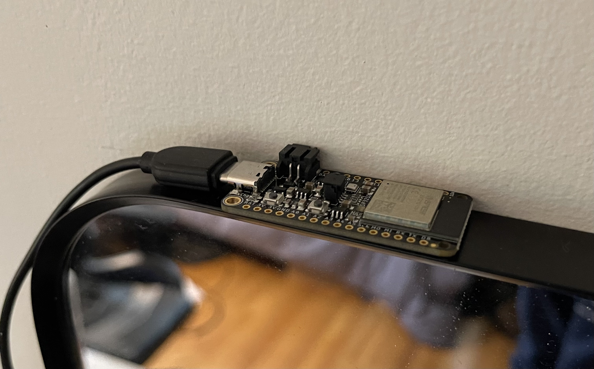
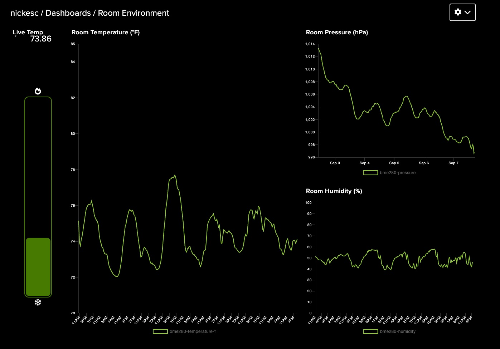

<h3 align="center" >
  <a href="https://github.com/nickesc/tempChecker"></a>
  <br>
  <h3 align="center">
    <code>tempChecker</code>
  </h3>
  <h6 align="center">
    by <a href="https://nickesc.github.io">N. Escobar</a> / <a href="https://github.com/nickesc">nickesc</a>
  </h6>
  <h6 align="center">
    a small project to track the temperature and other <br> conditions in my bedroom and other rooms of my house
  </h6>
</h3>
 

`tempChecker` was born out of a curiosity about the temperature in my room. It always seems to be different than the rest of the house, and I wanted to see whether or not I was just imagining it.

So, I set up a small hardware project to track it using a Feather microcontroller running CircuitPython.

### Requirements:
- 1x [Adafruit ESP32-S2 Feather - 4 MB Flash + 2 MB PSRAM](https://www.adafruit.com/product/5000)
- 1x USB Cable and power source
- a Wifi connection
- an Adafruit IO account

Every 6 minutes, the Feather grabs temperature, humidity and pressure readings from the onboard BME280 sensor.



> Here, you can see the microcontroller set up on top of the mirror in my room. It lives there, where it can sit unbothered long term. The red LED on the board lights up while sending data to Adafruit IO so that I know when a reading is being taken.

It sends those readings to Adafruit IO, which logs them and displays them on a [dashboard](https://io.adafruit.com/nickesc/dashboards/room-environment) that I've created.



### Deployment

Deploying the temp checker is very simple. To deploy the code to your own Feather:

1. Clone the repository to your computer:
```sh
git clone https://github.com/nickesc/tempChecker.git
```
2. Fill out your wifi and Adafruit IO account information in the `settings.toml` file
```toml
WIFI_SSID = "XXXXXX"
WIFI_PASSWORD = "XXXXXX"
ADAFRUIT_IO_USERNAME = "XXXXXX"
ADAFRUIT_IO_KEY = "XXXXXX"
```
3. [Ensure your Feather is running CircuitPython](https://learn.adafruit.com/adafruit-esp32-s2-feather/circuitpython)
4. Execute the `deploy.sh` script:
```sh
./deploy.sh
```
5. Eject the `CIRCUITPYTHON` drive
6. Find somewhere for the Feather to sit that it will not have to move from
7. Plug in the Feather and wait for readings to start coming in on Adafruit IO!

-----

### Acknowledgments

Much of the `tempChecker` code comes from [this page](https://learn.adafruit.com/adafruit-esp32-s2-feather/i2c-on-board-sensors) from Adafruit on the ESP32-S2 Feather. Code has been modified to work for my use case, but is mostly derived from that guide.

For other information on using the BME280 sensor, see [this guide](https://learn.adafruit.com/adafruit-bme280-humidity-barometric-pressure-temperature-sensor-breakout/python-circuitpython-test) and this [library repository](https://github.com/adafruit/Adafruit_CircuitPython_BME280).
